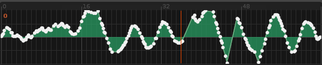
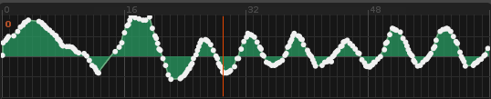

# Duplex.Applications.Automateable

< Back to [Applications](../Applications.md)

## About 

Automateable is a class that other applications can choose to extend. This makes it easy to create an application with built-in automation-recording.

You can specify how automation is recorded via the `record_method` option. 
_Please be aware that Automateable only records automation while edit mode is enabled in Renoise_. 

These are the available modes:

**Punch-in** : clears automation ahead of the current position  
  

**Interleave** : inserts automation without clearing values  
  

## High-resolution mode

From the Duplex tool menu you can choose between low-res (1 value per line) or high-resolution automation.  
Automateable will use whichever option you have selected. 

## Default options

> Can be overridden in [configurations](../Configurations.md)

| Name          | Description   |
| ------------- |---------------|  
|`record_method`|Determine if/how to record automation|  

## Changelog

1.01
- First release