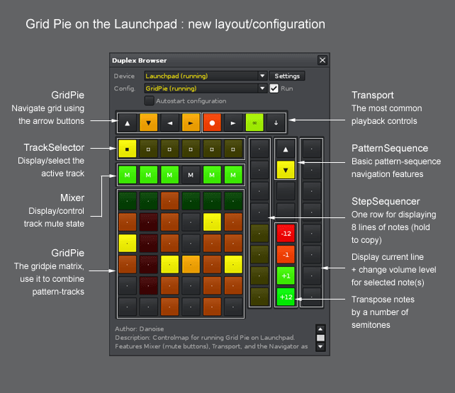

# Duplex.Applications.GridPie

< Back to [Applications](../Applications.md)

## About

Grid Pie is a performance interface. It lets the user combine different parts of a linear song, non-linearly, in real time, using a special looping pattern as a live drafting area. It does so by taking over the Pattern Matrix.

Grid Pie requires a grid-style controller to function - the more buttons you have, the larger an overview of the song you will get. 

## How does it work? 

Basically, you start by launching one of the controllers that come with a Grid Pie configuration. The launchpad is really suitable, as the display has been optimized for that particular controller.

Once you have selected the Launchpad and selected the Grid Pie config (there are actually two of those), hit "run" and Grid Pie will transform your song into a mode where you can combine everything with everything.

You will have to decide for yourself if you want to use it as a remix tool (combine various elements of an existing song), or as a compositional aide (most likely, to play around with the real-time poly-rhythmic features), or perhaps as something to use for your next live performance?

## Links

Discussion of Duplex GridPie is located on the [Renoise forum](http://forum.renoise.com/index.php?/topic/33484-new-tool-28-duplex-grid-pie/)

## Example configuration

  
*The Duplex GridPie configuration for the Launchpad*

## Available mappings
  
| Name       | Description   |
| -----------|---------------|  
|`v_prev`|GridPie: Press and release to display previous part of sequence Press and hold to display first pattern|  
|`h_slider`|GridPie: select pattern in sequence|  
|`v_slider`|GridPie: select track in pattern|  
|`h_next`|GridPie: Press and release to display next tracks in pattern Press and hold to go display last track|  
|`h_prev`|GridPie: Press and release to display previous tracks in pattern Press and hold to go display first track|  
|`v_next`|GridPie: Press and release to display next part of sequence Press and hold to display last pattern|  
|`grid`|GridPie: Press and release to copy track Press and hold to copy pattern Control value: |  

## Default options 
  
> Can be overridden in [configurations](../Configurations.md)

| Name          | Description   |
| ------------- |---------------|  
|`hold_enabled`|Enable this option only if your controller is capable of transmitting 'release' events (copy a pattern by pressing and holding a button in the grid)|  
|`shutdown`|How Grid Pie should behave when shut down|  
|`page_size_h`|Specify the horizontal page size|  
|`initialization`|How Grid Pie should behave when launched|  
|`page_size_v`|Specify the vertical page size|  
|`measure`|Set this to the time signature of your song - it affects how the 'beat-keeping' feature will work. It is likely that you will use 'Four', as most music is in 4/4|  
|`follow_pos`|Enable this to sync the active pattern/track between Renoise & GridPie|  

## Default palette 
  
> Can be overridden in [configurations](../Configurations.md)

| Name          | Color|Text|Value|
| ------------- |------|----|-----|  
|`empty_active`|
0x40,0x40,0x00
|·|true|  
|`out_of_bounds`|
0x00,0x00,0x00
|·|false|  
|`gridpie_normal`|
0x80,0x80,0x00
|·|false|  
|`out_of_bounds_current`|
0x40,0x80,0x00
|·|false|  
|`button_prev_patt_on`|
0xFF,0x80,0x00
|▲|true|  
|`button_prev_track_on`|
0xFF,0x80,0x00
|◄|true|  
|`empty_active_current`|
0x40,0x40,0x00
|·|true|  
|`empty`|
0x00,0x00,0x00
|·|false|  
|`button_prev_patt_off`|
0x00,0x00,0x00
|▲|false|  
|`inactive_content`|
0x40,0x00,0x00
|·|false|  
|`content_active_master`|
0x80,0x80,0x00
|·|false|  
|`content_active`|
0x80,0x40,0x00
|·|false|  
|`content_active_current`|
0x40,0x80,0x00
|·|false|  
|`gridpie_homeless`|
0xFF,0xFF,0x00
|·|true|  
|`button_prev_track_off`|
0x00,0x00,0x00
|◄|false|  
|`empty_current`|
0x00,0x40,0x00
|·|false|  
|`gridpie_alias`|
0xFF,0xFF,0x00
|·|true|  
|`button_next_track_off`|
0x00,0x00,0x00
|►|false|  
|`button_next_patt_on`|
0xFF,0x80,0x00
|▼|true|  
|`button_next_track_on`|
0xFF,0x80,0x00
|►|true|  
|`gridpie_current`|
0x40,0x80,0x00
|·|false|  
|`button_next_patt_off`|
0x00,0x00,0x00
|▼|false|  
|`content_selected`|
0xFF,0xFF,0x00
|·|true| 

## Changelog

1.01
- Tool-dev: use cLib/xLib libraries

0.99.23
- FIXME (Recording) better handling of patt. cloning near boundaries
- TWEAK “Keep the beat” changed to modify playback-pos less often
- FIXME Sess-rec.: “Stuttering” after short pattern (incremental_update)
- FIXME Assign to slot: use patt-idx, not seq-idx (doh!)
- FIXME Do not block “trigger gestures” in separate tracks
- FEATURE Record: when triggering a pattern, use incremental updates
- FEATURE Shorten pattern instead of modifying playback-pos (when possible)
- FEATURE skip group tracks when temp-muting
- FEATURE When muting track, delay note-off (to keep existing instr.)
- FIXME Incremental updates should use the master slot range only
- FIXME Don’t signal “dun goofed” when not started
- USABILITY Restore matrix state when GP pattern is “dun goofed”

0.99.22
- Overview of new features:
  - Realtime recording (including session recording)
  - Multitouch gestures (assign/resolve aliases, save combination, etc.)
  - Visualization of aliased slots, current track + pattern etc.
  - Configurable initialization and shutdown process (options)
  - Many smaller bug fixes, cleaner code 
- Feature: assign an alias by pressing and holding a slot button (source), and
  then pressing another button in the same track. The procedure will only
  work when the source slot is already aliased or empty (to avoid accidents)
- Feature: to complement the assignment gesture just mentioned, you can hold
  the button pressed to “force-assign” slots that are empty, or unique
- Feature: resolve any aliased slots in the gridpie pattern to it’s master slot
  by pressing a slot in the gridpie pattern (the last pattern). Conceptually
  similar to the pattern-editor (arrow in the lower part of an aliased track)
- Feature: quickly store “homeless” content (a track in the gridpie pattern with
  no master slot), either by creating a new pattern to hold the data or by
  assigning the content to an existing slot
- Feature: hold a gridpie button to save the combination as a new pattern
- Feature: make an alias unique (un-alias) by holding it, then it’s gridpie slot
- Tweak: highlight the selected alias master slot (if any exists)
- Tweak: better visualization of the current track/sequence position
- New option: “highlight”, toggles track/sequence highlighting on/off
- New option: auto-start has been expanded into “initialization”
- New option: “shutdown”, use it to control the shutdown procedure
- Fixed: de-activating a group track will not send the brief mute (avoid click)
- Fixed: properly update mute state when gridpie is cloned
- Fixed: line notifiers could get lost when scrolling through the song
- Fixed: UI integration with Renoise pattern-matrix is gone (buggy)
- Restructured code, simplified things

0.99.21
- Fixed: retain mute state when toggling a pattern off (hold x2)
- Fixed: track navigation could show wrong track on startup
- Feature: turbocharged mode (using a pattern cache along with aliased slots)
- Feature/workflow: (even) closer integration into Renoise
  + detect changes to mute states in the Renoise matrix (mouse+alt-click)
  + detect when a pattern has been scheduled in Renoise
  + disable pattern loop to allow song to play, pattern-by-pattern (1)
- Feature/workflow: ability to clone gridpie pattern while playing

(1) This, and pattern scheduling via Renoise can be considered experimental as 
we can’t reliably detect a scheduled pattern. As a result, the first few 
note(s) might be skipped!

0.99.20
- Edit-sync: automatic background-synchronization of pattern data
- Edit-sync: detect changes to the pattern length (source tracks)
- Update grid display as content is created or removed in the matrix
- Visualize the currently selected pattern (when the controller is able to)
- Attempt to maintain pattern matrix slot mute states at all times (1)
- Ability to clone the __GRID PIE__ pattern without stopping the application
- New option: Beat-measures (related to the improved ‘keep the beat’ feature)
- Fixed: removed display-glitch in the virtual UI (on startup)
- Fixed: remove all notifiers when app is stopped

(1) GridPie will attempt to retain as much information about the mute state of 
the song as possible, as this is restored when we exit GridPie. Note however 
that using drag-and-drop within the pattern sequence will cause the mute state 
to become lost for the rearranged patterns. Simple insert/clone and delete 
actions should not cause this to happen.

0.98.32 
- FEATURE Support for blinking LEDs on monochrome devices

0.98.29 
- FIXME Ignore pattern switching, when arriving in the last line of pattern
  (this avoids that using the Navigator will cause the pattern to switch)

0.98.18
- Disable of “follow_player” now only enforced outside the grid-pie pattern

0.98.17
- fixed a bug in the “running start” feature (when switching away from Grid 
  without having run the application)

0.98.16
- Features: “Keep the beat” and “running start”

0.98 
- First release

