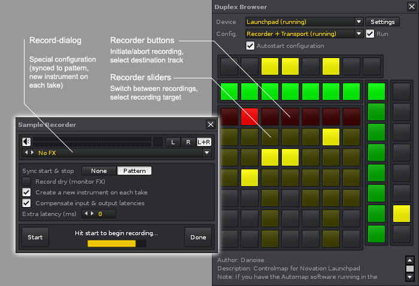

# Duplex.Applications.Recorder

## About

Use the Recorder application to record and loop any signal that you feed into Renoise, be that your voice, a guitar etc. 

* Flexible mappings: record using buttons, dials etc.
* Loop samples with different lengths, allowing for poly-rhythms.
* Supports sessions - restore recorded sessions next song is loaded

### How it works

Recorder operation is divided into a number of steps:

* Press a button to select the track and bring up the recording dialog
* Press again to start recording
* Once done, the sample is (optionally) looped/synced to the beat, and you’re  instantly able to switch among this, and all the other recordings you’ve made. 

Note that when reading the following description, and using a controller with faders/dials instead of a (button-based) grid controller, you don’t have “sample slots” that you can press - instead, the recorder button is used for this purpose. But otherwise, the description is pretty much the same. 

 1. *Track select stage*  
    Press any recorder button to open/close the recording dialog for the desired 
    track (you can only record into sequencer tracks). When the recording dialog 
    has been opened, a sample slot will start to blink slowly. Press the sample 
    slot to enter the next stage. If your controller supports “hold” events, you 
    can also hold a recorder button for a moment to start recording as soon as 
    possible. 
 
 2. *Preparation stage*  
    The preparation stage is the time spent before the playback position enters 
    the beginning of the pattern and begin the actual recording. On the recording 
    dialog it will read “Starting in XX lines..”, and the selected sample slot 
    will be  flashing rapidly. As long as you’re in the preparation stage, you can 
    hit the sample slot again to tell the Recorder that you wish to record only a 
    single pattern (now, both the the recorder button and the sample slot will 
    start flashing rapidly). This is known as a short take, and will take you 
    straight from the preparation stage to the finalizing stage.
 
 3. *Recording stage*  
    In the recording stage, you’ll see both the recorder button and the sample 
    slot blinking slowly, in time with the beat. There is no limit to the length 
    of the recording, except of course the amount of RAM you computer has 
    installed, so you can keep it going for as long as you desire. 
    Press the sample slot again to stop the recording and enter the finalizing 
    stage.
 
 4. *Finalizing stage*  
    The finalizing stage is the time spent while recording before the playback 
    reaches the beginning of a pattern. On the recording dialog it will read 
    “Stopping in XX lines..”, and the recording button will be flashing rapidly. 
    While you’re in the finalizing stage, pressing the sample slot will write the 
    yet-to-be sample to the pattern (however, this is only useful if you’ve not 
    enabled the writeahead mode, which does this automatically for you). 
 
 5. *Post-recording stage*  
    Immediately after the recording has been made, the resulting sample is 
    automatically renamed, and the recording dialog is closed. We’re ready for 
    another recording. 

> Hint: you can choose another destination track for the recording, or abort the recording at any time. Use the recorder button to select another track, and turn a dial/select an existing sample slot to abort the recording.

### Notes

  - The Recorder has been designed for recording samples that are synced to the 
    pattern length, creating a new instrument for each recording. If you choose 
    other settings, the results may be unpredictable. 
  - Please be careful when changing the tempo while recording, as this will 
    break the beat-sync of samples.
  - When you record something using the Recorder, each recording is named 
    something like “Track #2 - Recording #1” - please do not edit these names, 
    as they are used for keeping track of the recordings you have made.
  - Autostart is an extra note that's being written to the pattern immediately
    after a new recording has been made. Because Renoise needs a little moment
    to actually make the sample available for playback, the autostart option 
    has been added so you can adjust how quickly we should attempt to start
    playback. Adjust the amount so it matches your setup: the higher tempo your
    track is, the higher autostart value you need (for reference, with a delay 
    of one line at LPB4, autostart will break at around 185 BPM)
  - Due to the way the scripting API works, some notifiers will only work when 
    specific parts of the interface are visible. For example, the Recorder is 
    automatically selecting active recordings as playback is progressing, but we 
    never get the notification that the pattern has changed while in the 
    instrument/sample editor

## Example configuration

  
*The Duplex Recorder configuration for the Launchpad*

## Available mappings 

| Name          | Description   |
| ------------- |---------------|
|`sliders`|Recorder: Switch between takes|  
|`recorders`|Recorder: Toggle recording mode|  

## Available options 

| Name          | Description   |
| ------------- |---------------|
|`auto_seek`|Choose if new recordings should have autoseek enabled (note that autoseek will make 05xx triggering useless)|  
|`autostart`|Determine how many lines to use for autostart (autostart will write the note to the pattern immediately after recording has finished. If the value is too low, the note might not play the first time, as the sample takes a moment to be initialized properly)|  
|`beat_sync`|Choose if new recordings should automatically be synced to the song tempo (max. 512 lines)|  
|`first_run`|First time Recorder is launched, provide instructions|  
|`follow_track`|Enable this if you want the Recorder to align with the selected track in Renoise|  
|`loop_mode`|Select the default loop mode for new recordings|  
|`page_size`|Specify the step size when using paged navigation|  
|`trigger_mode`|Choose how notes are written to the pattern|  

## Changelog

1.01
- Tool-dev: use cLib/xLib libraries

0.98.28
- Fixed issue with “autostart” option (broke the recording workflow)

0.98.18
- Fixed: under certain conditions, could throw error on startup

0.98
- First-run message explaining how to set up a recording
- Detect v3 API and use alternate FX commands

0.97
- Any number of tracks supported, option to follow current track
- Supports paged navigation features (previous/next, page size)
- Detect when tracks are inserted/removed/swapped, maintain references

0.96  
- Detect when tracks are swapped/inserted/removed
- Full undo support (tracks changes to pattern and recordings)
- Unlimited number of tracks (paged navigation)
- Option: page_size & follow_track

0.95  
- First release

