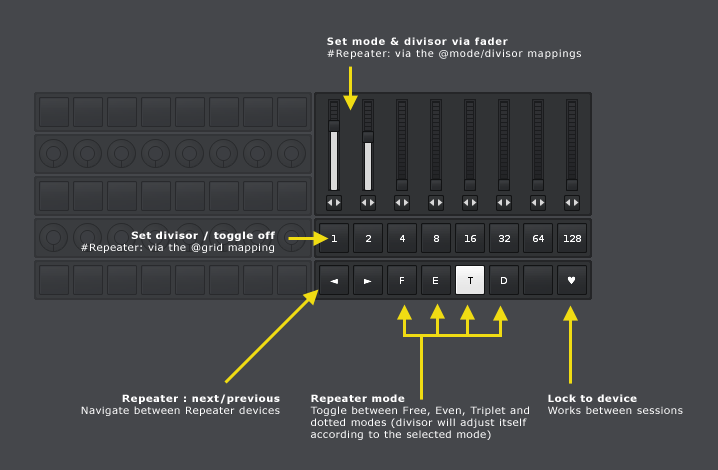

# Duplex.Applications.Recorder

## About

The Duplex Repeater application allows you to take control of any repeater DSP device in a Renoise song.  

## Features
* Jump between different repeater devices in the song
* Remember focused device between sessions
* Built-in automation recording 

## Example configuration

  
*The Duplex Repeater configuration for the Remote SL MKII*

## Available mappings 

| Name          | Description   |
| ------------- |---------------|
|`divisor_slider`|Repeater: Control divisor using a fader/knob|  
|`grid`|Repeater: button grid|  
|`lock_button`|Lock/unlock device|  
|`mode_even`|Repeater: Set mode to 'even'|  
|`mode_dotted`|Repeater: Set mode to 'dotted'|  
|`mode_triplet`|Repeater: Set mode to 'triplet'|  
|`mode_free`|Repeater: Set mode to 'free'|  
|`mode_slider`|Repeater: Control mode using a fader/knob|  
|`next_device`|See [RoamingDSP](RoamingDSP.md)|  
|`prev_device`|See [RoamingDSP](RoamingDSP.md)|  

## Available options 

| Name          | Description   |
| ------------- |---------------|
|`divisor_max`|Specify the minimum divisor value|  
|`divisor_min`|Specify the minimum divisor value|  
|`hold_option`|Determine what to do when a button is released|  
|`mode_select`|Determine the working mode of the grid: Free: scale between 1/1 and 1/128 Even: display only 'even' divisors Triplet: display only 'triplet' divisors Dotted: display only 'dotted' divisors Automatic: display 'even','triplet' and 'dotted' divisors, each on a separate line (automatic layout)|  
|`locked`|See [RoamingDSP](RoamingDSP.md) |  
|`record_method`|See [RoamingDSP](RoamingDSP.md)|  
|`follow_pos`|See [RoamingDSP](RoamingDSP.md)|  

## Changelog

1.01
- Tool-dev: use cLib/xLib libraries
- High-res automation recording (interleaved or punch-in)

0.98
- First release

