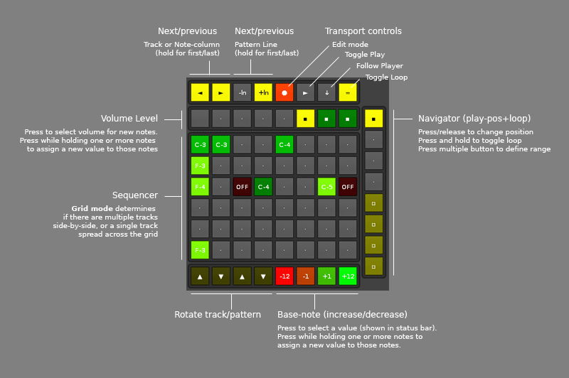

# Duplex.Application.StepSequencer

< Back to [Applications](../Applications.md)

## Introduction

The Duplex StepSequencer is a step sequencer for grid/pad-based controllers. You operate it by holding and pressing buttons in specific combinations - as a consequence, your controller must be able to send both press and release events. 

Features at a glance: 

* Multiple grid layouts (multi/single track)
* Copy/paste of notes, "batch" adjust volume and pitch
* Realtime preview (trigger instrument notes)
* Supports [paged navigation](../Concepts.md#paged-navigation) for tracks and lines

## Modes/Layouts 

The sequencer can be used in two different modes:

* **Single Track/Column** : The entire grid is used for displaying the selected track/column. While the song is playing, the active position is shown as a highlighted button in the grid.
* **Multiple Tracks** : The grid is divided into a number of 'track lanes' (displayed side-by-side). While the song is playing, the active position is shown in the volume selector.

You can switch between these layouts from the controller by assigning [@cycle_layout](#available-mappings) to a button, or via the [@grid_mode](#available-options) option.

## Editing workflow

* **Entering notes** : To add a note, press an empty/unlit button in the sequencer grid (the area used for displaying and entering notes). A new note is written to the track, using the currently selected instrument, base-note and volume.  
If nothing is written, check if edit mode is disabled in Renoise. It's possible to control when the sequencer can write notes by changing the [@write_mode](#available-options) in the Duplex browser to 'Always'. 
* **Clearing notes** : When a note exists, its position is lit up in the sequencer grid. Simply press and release the button to remove the note. 
* **Copy/paste notes** : In the sequencer grid, press and hold a lit button to copy the note. This will memorize the note properties: volume and pitch. Once it has been copied, any new notes you enter will use those properties. 
* **Adjusting base note and volume:** Press level/transpose buttons to adjust the base-note and default volume. Any notes entered afterwards will use these values. 
* **Transpose existing notes:** Press and hold the desired notes, and then press the transpose buttons. Changes are immediately applied to all held notes. 
* **Adjust note volume for existing notes:** Press and hold the desired notes and then adjust the volume level. Changes are immediately applied to all held notes.

## Realtime preview 

The StepSequencer allows you to preview notes without entering them into the pattern. To enable this feature, change the [play_notes option](#available-options) to 'Enabled'. 

> #1. Notes are only previewed when the sequencer is not writing into the pattern. Depending on your settings, you might need to disable edit-mode in Renoise to hear anything. 

> #2. The preview is using the OSC server in Renoise. Please check that you have [configured it correctly](../Installation.md#enable-the-renoise-osc-server), or you will not be able to hear anything. 

## Other tips and tricks

* **Semi-automatic playback follow** : this 'hidden' feature synchronizes the visible display of the sequencer with the currently playing position in Renoise immediately after having enabled Playback Follow. The idea is to have a quick and easy way to "catch up" with whereever Renoise is, without being forced to follow the playing position at all times.  
The mode is activated immediately after you enable Playback Follow in Renoise (usually done by pressing SCROLL_LOCK). To stop following, press any of the internal navigation buttons (prev/next track,line).

* **Linked instruments/tracks** : By default, the sequencer will use whatever instrument is selected for output. But you can link instruments and tracks together in a very simple way: simply assign name the track the same as the instruments. As you move between tracks and enter notes, the sequencer will use the provided instrument instead of the selected one.

## Example Configuration

  
*The Duplex StepSequencer configuration for the Launchpad*

## Available mappings
  

| Name       | Description   |
| -----------|---------------|  
|`track`|Sequencer: Flip through tracks/columns|  
|`cycle_layout`|Sequencer: Cycle through available grid layouts|  
|`grid`|Sequencer: press to toggle note on/off Hold single button to copy note Hold multiple buttons to adjust level/transpose Control value: |  
|`line`|Sequencer: Flip up/down through lines|  
|`transpose`|Sequencer: 4 buttons for transpose 1st: Oct down 2nd: Semi down 3rd: Semi up 4th: Oct up Control value: |  
|`levelsteps`|Sequencer: Increase the note volume step wise|  
|`levelslider`|Sequencer: Adjust note volume|  
|`level`|Sequencer: Adjust note volume|  
|`next_line`|Sequencer: Go to next line|  
|`prev_line`|Sequencer: Go to previous line|  

## Default options 
  
> Can be overridden in [configurations](../Configurations.md)

| Name          | Description   |
| ------------- |---------------|  
|`follow_column`|Enable this if you want to align the sequencer to  the currently selected column in pattern|  
|`follow_line`|Enable this if you want to align the sequencer with  the selected line in pattern|  
|`volume_steps`|Specify the step size of the volume-steps button|  
|`follow_track`|Enable this if you want to align the sequencer to  the selected track in pattern|  
|`page_size`|Specify the step size when using paged navigation|  
|`write_mode`|Choose if you want to write notes to the pattern dependent from Renoise's edit mode.|  
|`line_increment`|Choose the number of lines to jump for each step  when flipping through pattern|  
|`play_notes`|Choose if you want to play the instrument / note on pushing a trigger pad or grid button. If 'Write mode' is set to 'Only in edit mode'  notes will be played only if edit mode is off.|  
|`display_notes`|Choose if you want to display the note valuesonto the grid buttons in Duplex|  
|`grid_mode`|Choose if you want to edit multiple tracks with the grid or only one track.|  
    
## Default palette 
  
> Can be overridden in [configurations](../Configurations.md)

| Name          | Color|Text|Value|
| ------------- |------|----|-----|  
|`slot_level_1`|
0x00,0x40,0xFF
|▪|true|  
|`out_of_bounds`|
0x40,0x40,0x00
|·|false|  
|`next_line_on`|
0xFF,0xFF,0xFF
|+ln|true|  
|`slot_level_4`|
0x00,0xFF,0xFF
|▪|true|  
|`prev_line_off`|
0x00,0x00,0x00
|-ln|false|  
|`slot_level_2`|
0x00,0x80,0xFF
|▪|true|  
|`slot_empty`|
0x00,0x00,0x00
|·|false|  
|`slot_level_3`|
0x00,0xC0,0xFF
|▪|true|  
|`slot_level_5`|
0x40,0xFF,0xFF
|▪|true|  
|`transpose_12_up`|
0x00,0xFF,0xFF
|+12|false|  
|`slot_muted`|
0x40,0x00,0x00
|▫|false|  
|`slot_highlight`|
0xFF,0xFF,0xFF
|·|false|  
|`next_line_off`|
0x00,0x00,0x00
|+ln|false|  
|`prev_line_on`|
0xFF,0xFF,0xFF
|-ln|true|  
|`transpose_1_up`|
0x40,0xC0,0xFF
|+1|false|  
|`transpose_12_down`|
0xFF,0x00,0xFF
|-12|false|  
|`transpose_1_down`|
0xC0,0x40,0xFF
|-1|false|  
|`slot_level_6`|
0x80,0xFF,0xFF
|▪|true|  
|`slot_current`|
0x00,0x00,0x00
|·|false|  

## Changelog

1,02
- Changed default options (always write, enable preview and note names)

1.01
- Tool-dev: use cLib/xLib libraries
- Added: "cycle_layout" (mapping) - cycles through available grid modes
- Added: Note-offs can now be copied and pasted like any other note
- Added: Highlight playback position while in single-track mode
- Fixed: "hold to copy" got broken with 0.99 in multiple-track mode
- Fixed: "top page" (hold prev.line button) led to second page, not first
- Fixed: "track navigation" was broken (had no effect)
- Fixed: vertical grid layout caused problems for the volume control
- Fixed: (duplex core) showing note names no longer corrupts UI layout 
- Removed: "hold to focus", was more confusing than useful

0.99 (by Eran Dax Lonker)
- Added: "grid mode" option - use all grid buttons for only one track/column
- Added: "follow column" option - use the currently selected column
- Added: "Write mode" option - insert notes only if pattern edit mode is on
- Added: "Play notes" option - plays the current note if trigger pads is
          pushed (via OSC, if "Write notes" set not to "All time", notes 
          will be played only if pattern edit mode is off.)
- Added: "display notes" option - display notes + volumens on the grid buttons
- Added: new mapping "levelslider" (single slider for setting the volume) 
         new mapping "levelsteps" (single button for rotating the volume)
- Added: grid mapping parameter button_size - only needed to decide whether
          it's possible to display the note volume in addition to the note value
- Fixed: wrong note octave in renoise notifications 

0.98.21
- Support line_notifier when slots are aliased (also when created and/or removed)
- Workflow: when navigating from a long pattern into a shorter one, start from 
  the top (IOW, always restrict to the actual pattern length)
- Fixed: update the volume-level display when base volume is changed
- Fixed: selecting a group track could cause an error

0.98.20
- Fixed: focus bug when holding button

0.98.18
- Mappings track, level, line, transpose are now optional. This should fix an 
  issue with the nano2K config that didn’t specify ‘track’
- Fixed: under certain conditions, could throw error on startup

0.98  
- Palette now uses the standard format (easier to customize)
- Sequencer tracks can be linked with instruments, simply by assigning 
  the same name to both. 
  UISpinner (deprecated) control replaced with UISlider+UIButton(s)

0.96
- Option: "follow_track", set to align to selected track in Renoise
- Option: "track_increment", specify custom step size for track-switching

0.95  
- The sequencer is now fully synchronized with the currently selected 
  pattern in  Renoise. You can copy, delete or move notes around, 
  and the StepSequencer will update it's display accordingly
- Enabling Renoise's follow mode will cause instant catch-up
- Display volume/base-note changes in the status bar
- Orientation: use as sideways 16-step sequencer on monome128 etc.
- Option: "increment by this amount" value for navigating lines
- Improved performance 

0.93  
- Support other devices than the Launchpad (such as the monome)
- Display playposition and volume simultaneously 

0.92 (by daxton.fleming@gmail.com)
- Original version 
