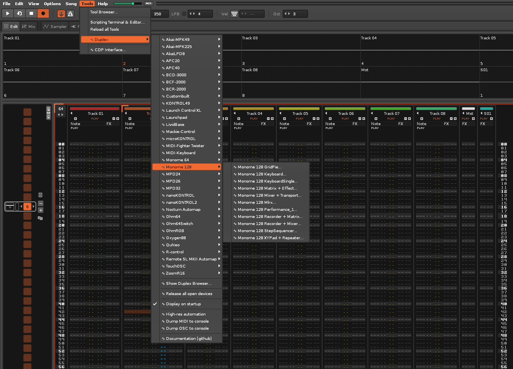
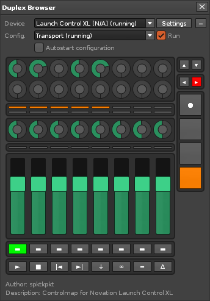
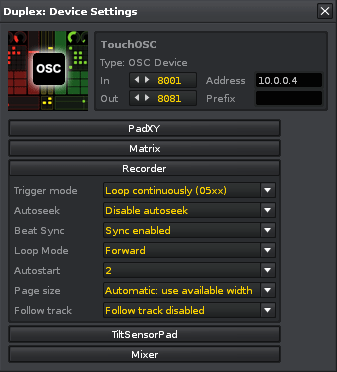
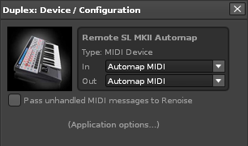
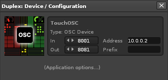

# Getting Started

## The front-end 

For the most part, the Duplex front-end is designed to be self-documenting - mouse over any part of the interface to get help and additional information about what each buttons/control does. The following is a quick walk-through of the most important user-interface elements, and how they work:

When Duplex is first installed, a sub-menu labelled Duplex will appear in the tools menu

  
*The tool menu provides instant access to device configurations*

| Name          | Description   |
| ------------- |---------------|
|Show browser|Display the [Duplex browser](#the-duplex-browser), for navigating devices
|Tool Options| Show the [Options dialog](#the-options-dialog), for configurating the tool

Furthermore, the menu provides quick access to all of Duplex’ presets (a.k.a. device configurations). Each one comes with a descriptive name such as "Launchpad Mixer + Matrix", or "Simple TouchOSC template", categorized by the device name. Each of these configurations represent a mix of application that we have found to be useful, sometimes selected by popular vote. Select any one of them, and the Duplex Browser dialog will appear.

### The Duplex Browser

The browser is the heart of Duplex. From here, you can choose between the supported devices at the top, and see the currently selected configuration below, represented as a 'virtual control surface'.  

Just because you can only see a single controller on the screen, that doesn't mean that you can't run multiple concurrent devices configurations. When a device is presently active and running, it will contain an additional “(running)” suffix appended to it’s name.

> You can quickly close/release all running devices & configurations by selecting the topmost configuration called `None`, or choosing 'Release all devices' from the tool menu.  

  
*The Duplex browser running a device configuration*

| Name          | Description   |
| ------------- |---------------|
|Run| Specify if the application is presently active / responding to input
|Autostart| Make the selected application start when Renoise is launched
|Settings| Show the Device Dettings
|Plus/Minus| Shows or hides the virtual control surface

### The Options dialog

The Options dialog can be launched from the tool menu.

  

| Name          | Description   |
| ------------- |---------------|
|Show browser|Display the Duplex browser, the primary UI for displaying and navigating devices
|Display on startup| Enable this to show the Duplex browser on startup. This will only have an effect when one or more device configurations have been selected to “autostart”
|High-res automation| Enable high-res automation recording for all applications that implement [Automateable](Applications/Automateable.md)
|OSC Protocol| The Renoise OSC server protocol that Duplex requires
|OSC Host| The OSC host that Duplex should connect to
|OSC Host| The OSC port number that Duplex should use
|Dump MIDI| Print MIDI messages to the Renoise scripting terminal
|Dump OSC| Print OSC messages to the Renoise scripting terminal
|Links & Resources| Online documentation and support (open links in browser)

### The Device / Configuration dialog

Each configuration has a settings dialog, which contain the device configuration, as well as application-specific options below. All settings are unique for this particular device configuration, with changes being applied in real-time. 

#### MIDI Device Settings

> See also [Using MIDI Controllers](Controllers.md#using-midi-controllers)

  

| Name          | Description   |
| ------------- |---------------|
|In|MIDI Input port for the device
|Out|MIDI Output port for the device
|Pass Unhandled Messages|Lets unmapped parameters (buttons and sliders) pass their MIDI messages on to Renoise. [Learn more](Concepts.md#midi-through--pass-unhandled-messages) about this feature.

#### OSC Device Settings

> See also [Using OSC Controllers](Controllers.md#using-osc-controllers)

  

| Name          | Description   |
| ------------- |---------------|
|In|OSC Input port for the device
|Out|OSC Output port for the device
|Address|The remote IP address or host-name 
|Prefix|The OSC prefix to use (if any)

> < Previous - [Installation](Installation.md) &nbsp; &nbsp; | &nbsp; &nbsp; Next - [Bundled Applications](Applications.md) >