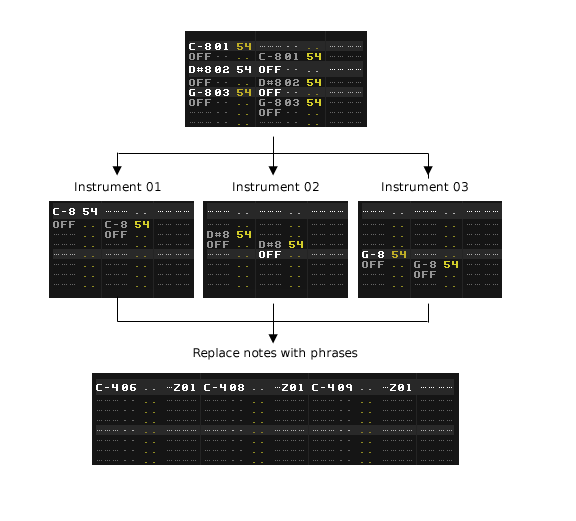

# PhraseMate

PhraseMate aims to make it more convenient to work with phrases in Renoise, particularly if you prefer a keyboard-centric workflow. Copy phrases into the pattern editor, or vice versa, and make the tool insert "set phrase" commands (Zxx) automatically as you are entering notes into a song.

## Quickstart

Download the tool from the [Renoise tool page](http://www.renoise.com/tools/phrasemate), and double-click or drag the xrnx file on top of the Renoise window to install.

The tool can be triggered in a number of ways:  

* From the Renoise Tools menu > PhraseMate
* From the supplied MIDI and keyboard shortcuts (search for 'PhraseMate') 
* By right-clicking the pattern editor/matrix  

## How it works

The tool has a number of distinctive operating modes:

### Input - convert pattern data into phrases

The input mode makes it easy to convert pattern data into phrases, and has a very flexible set of parameters.

Consider the following diagram for a possible phrase-capturing workflow:

 

Here, a single pattern-track containing three different instruments is collected as phrases in separate instruments. Then, the original pattern data is replaced by the phrases we just collected. 

Settings used:
 
	Source: 'Capture All Instr.'  
	Target: New instrument(s)  
	[x] Replace notes with phrase

### Output - convert phrases into pattern-data    

* **Anchor to selection** - when writing to a selection, determine if the output is written relative to the top of the selection, or the top of the pattern
* **Continuous paste** - when source phrase is shorter than pattern/selection, repeat in order to fill
* **Skip muted columns** - skip note-columns when they are muted in the phrase (will also clear columns, unless mix-paste is enabled)
* **Expand columns** - show additional note columns if required by source phrase
* **Expand sub-columns** - show sub-columns (VOL/PAN/DLY/FX) if required by source phrase
* **Mix-Paste** - attempt to keep existing content when producing output (same as Mix-Paste in the advanced edit panel)

### Realtime - monitor the pattern and insert Zxx commands

One of the exciting features in Renoise 3.1 is the program mode for phrases. It's awesome to be able to pull up any phrase and trigger it in any key. But, less awesome is the fact that it's easy to forget those pesky Zxx commands that goes along with each note. Hence, the "insert Zxx" mode of this tool.

When enabled, PhraseMate will listen for changes to the pattern and insert Zxx commands when it seems appropriate (or remove them if they are not required). **_It will only do so while you have the edit-mode enabled, and only while your selected instrument/phrase is set to program mode_**. 

Note that the realtime mode is experimental and has a few quirks - please see the following section with questions and answers...

## Questions & Answers

**Q: (Realtime mode) When I enter a note into the pattern at a location where there's already a Zxx command, I can't change it to "my" Zxx value**   

**A**: This is a limitation of the tool. An easy way to circumvent this limitation is by clearing the existing note first, or by manually selecting the phrase before entering the note (for convenience, you can use the next/previous phrase keyboard shortcuts for this purpose). 

--- 

**Q: (Realtime mode) When I paste data into Renoise, this tool is adding Zxx commands "everywhere". How can I avoid this?**   

**A**: PhraseMate is listening for changes to the pattern as long as edit mode is enabled in Renoise, and the instrument is set to 'Program' mode. So you can either disable Edit mode in Renoise (ESC) - many copy/paste clipboard actions will still be accessible - or set the instrument to 'Off' or 'Keymap' mode.   

--- 

**Q: (Output) After writing, why do the pattern sound differently than my phrase?** 

**A**: Most likely, because the instrument/phrase is using a harmonic scale. Unlike notes, phrases in Renoise are harmonized in real-time. It's a planned feature to support harmonization of notes on output. 

--- 

**Q: (Output) After writing my phrase to the pattern, the result is slower or faster than the source?** 

**A**: Phrases can have an independent LPB (lines-per-beat) value. PhraseMate does not attempt to change the speed when it creates output, but simply writes the data "as-it". Consider using a tool such as [this one](http://forum.renoise.com/index.php/topic/27930-new-tool-28-30-flexible-pattern-resizer/) if you would like to stretch or squash pattern data after it's written. 

## Implementation details
* (Input) When collecting phrases with the 'replace notes' option enabled, the tool cannot insert more than 12 phrase triggers per track. 
* (Input) When the source instrument is already making use of phrases, notes that trigger phrases are skipped
* (Input) When starting to collect phrases from the middle of a pattern/song, ghost notes are not resolved until an instrument is reached. As a result, the first notes might be missing. 
* (Output) Phrase output is currently limited to sequencer tracks (avoid targeting group/send/master tracks)

## Keyboard Shortcuts

	Global : PhraseMate : Show preferences...
	Global : PhraseMate : Create Phrase from Selection in Pattern
	Global : PhraseMate : Create Phrase from Selection in Matrix
	Global : PhraseMate : Create Phrase from Track
	Global : PhraseMate : Create Phrases from Track in Song
	Global : PhraseMate : Write Phrase to Selection in Pattern
	Global : PhraseMate : Write Phrase to Track
	Global : PhraseMate : Select Previous Phrase in Instrument
	Global : PhraseMate : Select Next Phrase in Instrument
	Global : PhraseMate : Capture Phrase from Pattern
	Global : PhraseMate : Set Playback Mode to 'Off'
	Global : PhraseMate : Set Playback Mode to 'Program'
	Global : PhraseMate : Set Playback Mode to 'Keymap'
	Global : PhraseMate : Insert New Phrase
	Global : PhraseMate : Delete Selected Phrase

## Menu Entries

	Main Menu : Tools : PhraseMate...
	Pattern Editor : PhraseMate : Create Phrase from Selection
	Pattern Editor : PhraseMate : Create Phrase from Track
	Pattern Editor : PhraseMate : Create Phrases from Track in Song
	Pattern Editor : PhraseMate : Write Phrase to Selection In Pattern
	Pattern Editor : PhraseMate : Write Phrase to Track
	Pattern Editor : PhraseMate : Adjust settings...
	Pattern Matrix : PhraseMate : Create Phrase from Selection
	Pattern Matrix : PhraseMate : Adjust settings... 

## MIDI Mappings

	Tools : PhraseMate : Create Phrase from Selection in Pattern [Trigger]
	Tools : PhraseMate : Create Phrase from Selection in Matrix [Trigger]
	Tools : PhraseMate : Create Phrase from Track [Trigger]
	Tools : PhraseMate : Create Phrases from Track in Song [Trigger]
	Tools : PhraseMate : Write Phrase to Selection In Pattern [Trigger]
	Tools : PhraseMate : Write Phrase to Track [Trigger]
	Tools : PhraseMate : Select Previous Phrase in Instrument [Trigger]
	Tools : PhraseMate : Select Next Phrase in Instrument [Trigger]
	Tools : PhraseMate : Select Phrase in Instrument [Set]
	Tools : PhraseMate : Select Playback Mode [Set]
	Tools : PhraseMate : Insert New Phrase [Trigger]
	Tools : PhraseMate : Delete Selected Phrase [Trigger]

