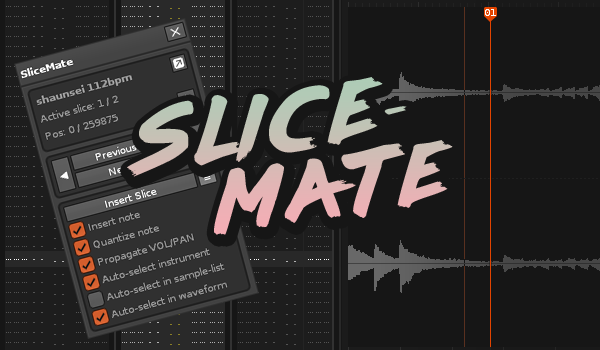
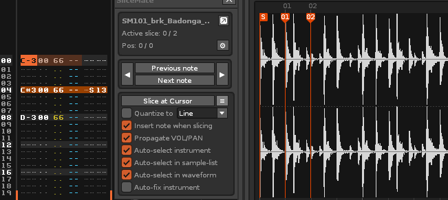

# SliceMate 

This tool makes it easy to slice auto-seeked samples and phrases from within the pattern editor. Perfect for remixing and working with rendered stems. 

## Links

* Download from tool page: http://renoise.com/tools/slicemate  
* Discuss in Renoise forum: http://forum.renoise.com/index.php/topic/49630-new-tool-31-slicemate/  
* Check for / report issues: https://github.com/renoise/xrnx/issues?utf8=%E2%9C%93&q=is%3Aissue+is%3Aopen+slicemate

## Features

* Easily slice samples and phrases from within the pattern editor
* Visualize the sample position in the waveform editor as you are navigating the song
* Able to determine the position in a sample, even when tuned/transposed 
* Supports real-time operation (slice a sample while listening to it) with optional quantization
* Can "slice" phrases too - also when using a different LPB than the song
* "Delay-column-aware", for maximum precision 

SliceMate has full support for sample offset commands (Sxx). This includes support on the sliced samples themselves, but also the special syntax Renoise has for the "root sample". 

  
_Pay attention to the selection in the waveform editor while commands are entered_

And it also understands when you've used the alternative Sxx-based approach to slice triggering
  
_Here, the Sxx command decides which slice is active_

## Quickstart

Download the tool from the Renoise tool page, and double-click or drag the xrnx file on top of the Renoise window to install.

The tool can be launched in a number of ways:

* From the Renoise Tools menu > SliceMate
* From the supplied MIDI and keyboard shortcuts (search for 'SliceMate')

### How to slice a sample

1. Load up some (long) sample and enter it into the pattern
2. Position the cursor somewhere in the 'note trail' 
3. Hit **"Slice at Cursor"**
4. If all went well, a new slice/note is inserted
5. Move cursor somewhere else, repeat and rinse 

### How to slice a phrase

1. Load an instrument which contains one or more phrases
2. Enter a note somewhere in the pattern. 
3. Enter a Zxx command for the note, or ensure that "Prg" mode is enabled
4. Position the cursor somewhere in the 'note trail' 
5. Hit **"Slice at Cursor"**
6. If all went well, a new note is inserted
7. Move cursor somewhere else, repeat and rinse 

## The user interface 

The user interface is organized into a number of panels:

### Status panel

The topmost part is displaying the current status

* Instrument name: show the name of the detected instrument (if any)
* Warning triangle: shown if the tool has detected any problems.
* Detach: click this button to detach the instrument editor 

Below, some more detailed information:

#### For samples

* "Slice": shows you which slice is currently selected
* "Pos": shows you the frame (position in sample) of the slice and/or root sample
* "Line": when slicing a beat-synced sample, the tool will show the current line (instead of frame)

#### For phrases

* "Phrase": shows you which phrase has been detected
* "Sxx" : shows you the "internal" line + delay of the phrase at this position

### Navigation panel

* Left/right arrows: allows you to navigate between columns and tracks
* Previous/next buttons: detect and move cursor to other notes/lines in the song 

### Slice panel 

The slice panel contains all buttons that are related to slicing. 

* **Slice at Cursor** - as the title says, pressing this button will slice the sample at the current position. If no sample is present, a dialog will appear and ask if a note should be written to the pattern.

* **Quantize** - determines the current quantization mode. Default is 'Beat', which is usually every four lines or so. Note that quantization always applies to Slice (Forward & Backward) and Fill, but only applies to 'Slice at Cursor' when explicitly enabled  (see options). 

* **Limit Fill** - here you can choose how to control fill actions. Default limit is 'Whole Pattern' - if you don't want any limit, simply choose 'Whole Song'. 

* **Slice (Forward & Backward)** - these buttons control the forward/backward slicing. 
Pressing either one will insert a slice with a distance which is determined by the currently selected `Quantize` option. In principle, these buttons do exactly the same as if you clicked 'Slice at Cursor', moved the cursor a few lines, clicked 'Slice at Cursor', etc.

* **Insert (Previous & Next)** - click these buttons to insert _existing_ slices into the pattern. Unlike with the other buttons, inserting will not create new slices. Note that the slices are automatically inserted with the actual playback duration - in theory, positioning the cursor at the trigger note and hitting "insert" repeatedly should create a seamless string of notes, recreating the full original sample. 

* **Fill (Up & Down)** - located next to 'Slice' and 'Insert'. Will repeat the selected action, using the selected `Quantize`, for as many times as the `Fill Limit` (scope) and sample length allows. Use this, for example, to insert slices for every beat throughout the currently selected pattern.

> Before creating a new slice, SliceMate checks if there is already an active slice at the provided position. If this is the case, that slice is simply reused. 

### Options panel 

This panel contains all options for SliceMate

#### Slice Options

* **Force Quantization**: enforce quantization when using 'Slice at Cursor'.  
Note that, even when disabled, the selected option is still the one in use by other slicing methods (Forward & Backward). Valid options are LINE,BEAT,BAR,BLOCK,PATTERN
* **Support phrase slicing**: enables transparent phrase-slicing support 
* **Insert note when slicing**: inserts a note in the pattern every time the sample is sliced.  
When set to false, a slice is still created but no note is inserted.
* **Propagate VOL/PAN**: when inserting a note, use the volume and panning from the previous one
* **Auto-fix instrument**: attempt to fix simple issues that prevent the tool from working, such as autoseek not being enabled. 

#### Selection 

These options deal with selections, as the cursor position changes:

* Auto-select instrument 
* Auto-select in sample list
* Auto-select in waveform  

> Note: if *any* if these options are enabled, the tool will track pattern contains as you navigate around the song (this is the default choice). 

#### General

* "Auto-start tool": will launch the tool when Renoise starts/on a new song

## Limitations

**The tool can only work with samples that have the AUTOSEEK option enabled.**  

Also, the tool is not able to reliably track the position if you are:

* **Using commands to modify the song tempo (BPM and LPB) *during* sample playback**. This doesn't mean that you can't change BPM or LPB in your song - simply do it before or after sample playback.
* **Using commands to control sample playback (e.g. 0Bxx/reverse)**. You *can* use these commands, but the tool will ignore whatever effect it might have on the sample playback, and instead, track time as if the sample was continuously playing. 

Finally, the tool does not support slicing looped samples. 
You can use the tool with such samples, but once the playback reaches the loop end-point, slicing is no longer possible (you should receive an warning if you try). 

