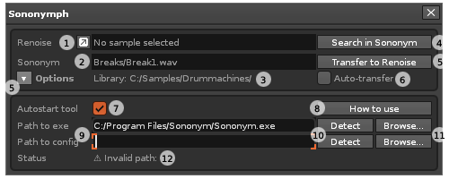

# Sononym(ph)

This tool is an integration of the Sononym sample browser into Renoise. Use it to browse for samples using the features in Sononym while listening to the result in the context of your Renoise project.

## Features at a glance

* Launch similarity search from the selected sample (Renoise → Sononym)
* Transfer samples from Sononym → Renoise 
* Replace samples in Renoise while browsing in Sononym (auto-transfer)

## Links

* Youtube demonstration: TODO
* Download from tool page: http://renoise.com/tools/sononymph  
* Discuss in Renoise forum: http://forum.renoise.com/index.php/topic/52097-new-tool-31-sononym-integration-preview/
* Check for / report issues: https://github.com/renoise/xrnx/issues?utf8=%E2%9C%93&q=is%3Aissue+is%3Aopen+sononymph

## Quickstart

1. Launch Renoise and start the tool from the Renoise tools menu.  
Note that the tool needs to be configured when you launch it for the first time.  
Follow the instructions on screen - see also the [preferences](#preferences) section below.
2. Launch Sononym - **IMPORTANT** ([more info](#search-in-sononym)).
3. Renoise: Select a sample and hit 'Search in Sononym' 
4. Sononym: Browse around until you find something good 
5. Renoise: Hit 'Transfer' to import the selected sample in Sononym

## The user interface

  

_#_ |Description
----|----------------
1   | Displays the currently selected sample in Renoise. Click the button to detach the instrument editor. 
2   | Displays the currently selected sample in Sononym
3   | Displays the Sononym library that the sample belongs to 
4   | [Launch a similarity search](#search-in-sononym) on the selected sample (1)
5   | Transfer the selected sample (2) from Sononym to Renoise 
6   | Enable or disable the [automatic transfer mode](#auto-transfer)
7   | Decides if the tool starts automatically when Renoise is launched
8   | Open a dialog containing user instructions 
9   | Specifies paths to [Sononym executable + configuration](#preferences)
10  | Click to auto-detect the Sononym paths (9)
11  | Click to open a file system dialog to set paths (9)
12  | Current tool status: "Monitoring...", "Invalid path"

## Additional notes

### Search in Sononym 
Click this button to launch a similarity search in Sononym using the currently selected sample in Renoise as the source.

**IMPORTANT: Sononym should be running _before_ launching a search** - 
otherwise the Sononym process might lock Renoise. If you do this by 
accident, simply close the Sononym window and start Sononym 
from its usual place (Start Menu, Dock, etc).

### Auto-transfer
Enable this to automatically replace samples in Renoise while browsing in Sononym. The mode detects when the selection in Sononym has changed, and will automatically perform a 'transfer'. 

### Preferences

#### Path to exe / path to config
The location of these paths depend on the operating system. The Sononym documentation specifies the typical locations, and how you can find them yourself: https://www.sononym.net/docs/installation/overview/)

