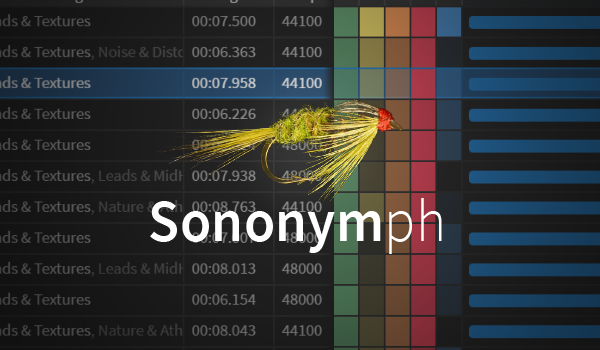

# Sononymph v1.10

**Sononymph** is a powerful integration tool that connects the Sononym sample browser with Renoise. This version includes extensive modifications and improvements by **Esa Ruoho (Lackluster)** for enhanced workflow and usability.

**Sononymph** uses the cLib class library for the majority of its features.

## Features

### Core Functionality
- **Bidirectional integration** between Renoise and Sononym
- **Similarity search** - Launch searches from a selected Renoise sample
- **Sample transfer** - Import a sample from Sononym with a single click
- **Auto-transfer mode** - Automatically replace a sample while browsing
- **Slice preservation** - Maintain slice markers and settings during transfer
- **Smart path detection** - Automatically finds Sononym installations

### Paketti Modifications
- **Multiple menu contexts** - Access Sononymph from Instrument Box, Sample Editor, Sample Navigator, and Main Menu Menu Entries.
- **MIDI mappings** - Search samples, toggle auto-transfer, and load samples via MIDI
- **Keyboard shortcuts** - Search samples, toggle auto-transfer, load samples, and open dialog
- **Enhanced auto-transfer** - Create new instruments or sample slots instead of just overwriting
- **Direct Sononym launch** - Start Sononym and browse folders from Renoise
- **Multi-version support** - Detect and select from multiple Sononym installations
- **Cross-platform support** - Improved Windows, macOS, and Linux compatibility

## Quick Start

1. **Launch Renoise** and start Sononymph from the Tools menu
2. **First-time setup** - Tool automatically detects your Sononym installation and query.json database location on Windows, macOS, or Linux
3. **Version detection** - If you install a new version of Sononym later, click "Detect" to find the new query.json folders and select from the dropdown menu
4. **Launch Sononym** (tool can do this for you via "Launch" button)
5. **Select a sample** in Renoise and click "Search in Sononym" 
6. **Browse in Sononym** until you find something good
7. **Transfer** - Click "Transfer from Sononym" or enable auto-transfer mode

## Interface Overview

### Main Dialog
- **Renoise section** - Shows currently selected sample with detach button
- **Sononym section** - Displays selected sample and library info  
- **Transfer controls** - Manual transfer button and auto-transfer toggle
- **Transfer options** - Create new instruments or sample slots
- **Options section** - Collapsible preferences panel

### Transfer Options
- **Default** - Replace current sample (preserves slices)
- **Create New Instrument** - Create fresh instrument for every auto-transfer or user-triggered transfer
- **Create New Sample Slot** - Add new sample slot to current instrument for every auto-transfer or user-triggered transfer

### Options Panel
- **AppPath** - Location of Sononym executable (auto-detected)
- **ConfigPath** - Location of query.json file (auto-detected) 
- **Version dropdown** - Select from multiple detected Sononym versions
- **Status indicator** - Shows monitoring status and path validation
- **Direct links** - Sononym documentation and forum thread
- **Autostart** - Launch tool automatically with Renoise

## Controls & Shortcuts

### MIDI Mappings
- **`Sononymph:Search Selected Sample in Sononym [Trigger]`** - Select a sample in Renoise, press a MIDI mapping and Sononym searches for similar samples - a very fast workflow.
- **`Sononymph:Toggle Auto-Transfer [Trigger]`** - Turn auto-transfer on/off from your MIDI controller. Useful when you want to browse Sononym without accidentally loading samples into your current track.
- **`Sononymph:Load Selected Sample from Sononym (Prompt) [Trigger]`** - Have Sononym open, select a sample, press a MIDI mapping and Renoise loads the sample with a confirmation dialog.
- **`Sononymph:Load Selected Sample from Sononym (No Prompt) [Trigger]`** - Have Sononym open, select a sample, press a MIDI mapping and Renoise instantly loads the sample without a prompt - a very fast workflow.

### Keybindings
- **`Global:Sononymph:Search Selected Sample in Sononym [Trigger]`** - Select a sample in Renoise, press a keyboard shortcut and Sononym searches for similar samples - a very fast workflow.
- **`Global:Sononymph:Toggle Auto-Transfer [Trigger]`** - Quickly enable/disable auto-transfer mode while working. Toggle off when browsing, on when you want samples to load automatically.
- **`Global:Sononymph:Open Sononymph Dialog...`** - Open the main Sononymph window without using menus. Fastest way to access the tool.
- **`Global:Sononymph:Load Selected Sample from Sononym (Prompt)`** - Have Sononym open, select a sample, press a keyboard shortcut and Renoise loads the sample with confirmation - a very fast workflow.
- **`Global:Sononymph:Load Selected Sample from Sononym (No Prompt)`** - Have Sononym open, select a sample, press a keyboard shortcut and Renoise instantly loads the sample - a very fast workflow.

### Menu Entries
Right-click context menus provide quick access:
- **Instrument Box** - Right-click any instrument to search for similar samples in Sononym or load from Sononym. Perfect when organizing your instrument collection.
- **Sample Editor** - Right-click while editing samples to search for similar ones in Sononym or replace with Sononym samples. Great for sound design workflow.
- **Sample Navigator** - Right-click samples in the browser to search in Sononym, replace them, or load Sononym samples directly to the selected slot. Includes the new "Load Selected Sample to Selected Slot" function for targeted sample loading. Useful when going through sample folders.
- **Main Menu → Tools → Sononymph** - Access all functions from the traditional menu. Best for first-time setup or when you need the full dialog.

## Platform Support

### Windows
- Auto-detects installations in Program Files
- Supports standard and custom installation paths

### macOS  
- Finds apps in /Applications/Sononym.app
- Handles bundle structure automatically

### Linux
- Searches PATH for 'sononym' executable
- Checks common installation locations
- Supports custom builds and package manager installations
- Fallback detection for non-standard setups

## Auto-Transfer Mode

When enabled, automatically imports samples as you browse in Sononym:
- **Preserves slice markers** and their settings
- **Switches to Sample Editor** view automatically  
- **Configurable behavior** - overwrite, new instrument, or new slot
- **Real-time monitoring** of Sononym's selection changes

## Troubleshooting

### Path Detection
- **First-time setup** - Tool automatically detects Sononym installation and query.json database location on Windows, macOS, and Linux
- **New version detection** - When you install a new Sononym version, click "Detect" to find new query.json folders
- **Multiple versions** - Select from dropdown menu when multiple Sononym versions are found
- **Manual override** - "Browse" buttons allow manual path selection if auto-detection fails

### Performance
- Tool monitors query.json file changes efficiently
- Lightweight native UI (no external dependencies)
- Minimal CPU usage when monitoring

## Links

- **Sononym Documentation**: https://www.sononym.net/docs/
- **Forum Discussion**: https://forum.renoise.com/t/new-tool-3-4-sononymph-with-paketti-improvements-renoise-sononym-integration/76581
- **Report Issues**: Create issues in your repository

## Credits

- **Original Tool**: danoise
- **Paketti Modifications**: Esa Ruoho (Lackluster): http://patreon.com/esaruoho
- **Version**: 1.10 - Added Sample Navigator selected slot loading functionality

---

*This tool requires Sononym to be installed and configured. Visit [sononym.net](https://www.sononym.net/) to download Sononym.*
