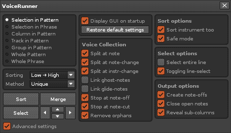
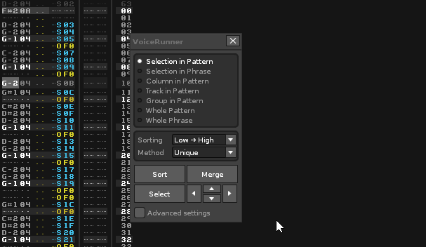
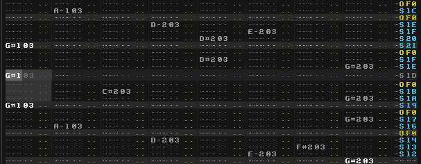

# VoiceRunner

This tool adds highly configurable pattern-data sorting to Renoise. 

## Quickstart

[Download the tool](http://forum.renoise.com/index.php/topic/48372-new-tool-31-voicerunner/) and double-click or drag the xrnx file on top of the Renoise window to install.

The tool can be triggered in a number of ways:  

* From the Renoise Tools menu > VoiceRunner
* From the supplied MIDI and keyboard shortcuts (search for 'VoiceRunner') 
* By right-clicking the pattern editor

## Discussion & Feedback

This tool is a work in progress. If you encounter a bug or have suggestions, use Renoise forum (the tool has a dedicated topic, located [here](http://forum.renoise.com/index.php/topic/48372-new-tool-31-voicerunner/)) or send me a mail (as specified in the [manifest](./manifest.xml) file).   

## Screenshot

If you launch the tool, the main dialog could look something like this (with all options shown)

 

_Hint: while the dialog is visible and focused, you can use the arrow keys to navigate between voice-runs in the pattern._  

Here's a GIF showing how unique notes can "unfold" a column and squash it together again

 

Another GIF showing how the built-in navigation between voice-runs works
(it selects anything matching the current collection options beneath the cursor position)

 

To use navigation, assign keybindings/MIDI mappings, or press arrow keys while the tool dialog is focused...

## Features

### Available scopes

**Selection in Pattern** - operate on the pattern-selection   
**Selection in Phrase** - operate on the phrase-selection  
**Column in Pattern** - operate on the selected (note-)column in the selected track    
**Track in Pattern** - operate on the selected track  
**Group in Pattern** - operate on tracks in selected group, or group that track is contained within   
**Whole Pattern** - operate on every track in the selected pattern   
**Whole Phrase** - operate on the selected phrase   

The selected scope applies to both _Merge_ and _Sort_ operations.    

### Sorting mode

**High-to-low, Low-to-high...**  
The selected mode affects all sorting operations. Low and high are referring to the note-value, where A-4 is considered a lower value than A-5.

### Sorting method

**Normal Method**  
Should give results that are both _readable_ (columns generally sorted by low-to-high or high-to-low) and _compact_ (note columns packed together as long as this doesn’t conflict with the sort mode). This is the default sorting mode. 
 
**Unique Method**    
The unique sorting method will examine the pattern and fit every note it encounters within a dedicated note-column. Use this mode to sort e.g. drum-tracks, where each note-column can represent a unique sound in the drumkit. 

**Compact Method**   
This mode is a compromise between the normal and unique method. It is a non-destructive sorting mode that reconstructs the pattern data, line by line. Unlike the normal sort, notes can appear "across columns", but will always respect the high-low or low-high direction on each individual line. 

### Buttons

**Sort**  
Press this button to sort notes in the pattern or phrase, using the selected scope. 

**Merge**  
Press this button to merge notes in the pattern or phrase, using the selected scope.  

**Select**  
Clicking _Select_ will (attempt to) capture the voice-run below the current cursor position. 

**Up/Down**   
Pressing these buttons will attempt to select the voice-run immediately before or after the cursor position.

**Left/Right**   
Pressing these buttons will select the voice-run (if any) in the previous/next note-column. 

## Options

### Overall options

**Launch on startup**  
Show the tool GUI when Renoise starts.
  
**Restore default settings**  
Reset to default settings, including user prompts.

### Collection options 

**Split at note**  
Enable this option to create a new voice-run for every note that is encountered.
      
**Split at note-change**  
Enable this option to create a new voice-run when notes with a new/changed note-value is encountered. 

**Split at note-change**  
Enable this option to create a new voice-run when a note with a new/changed instrument-number is encountered. 

**Link at ghost notes**  
Enable this option to include notes that does not have an instrument number, into the current voice-run.  
   
**Link at glide notes**  
Enable this option to include notes that are affected by a glide (Gx) command, into the current voice-run.   

**Stop at note-off**  
If enabled, the tool stops collecting data once a note-off command is reached. Usually this is safe option to enable, but since Renoise allows you to manipulate voices also after they have been released, you might want to leave it unchecked. 

**Stop at note-cut**  
Same as note-off, but applies to the Cx command.  

**Remove orphans**  
Enable this option to remove voice-runs that doesn't begin with a note. 

### Sort options

**Sort instruments too**  
Mostly relevant for unique sorting. Enable to split tracks by instrument _as well as_ the selected sorting mode. When disabled, only the sorting mode (high-low, low-high) is applied. 

**Safe mode**  
When disabled, sort operations are always carried out even when notes are lost as a result. When enabled, and there is not enough available note-columns to complete a sort operation, a popup dialog is shown which will allow hand-picking of notes to keep.  

### Select options 

**Select entire line**  
Determines how wide a selection is created by the 'Select' button. When enabled, selections are spanning the entire set of note-columns. When disabled, only the current note-column (or sub-column) is selected. 

**Toggling line-select**  
Enabling this feature makes the 'Select' button toggle between entire line and note-column each time it is pressed.    

### Output options 

**Create note-offs**  
When enabled, notes will receive a terminating note-offs or note-cuts as required. When disabled, no such thing. Use this e.g. for 'clean looking' drum tracks.  

**Close open notes**  
When enabled, notes that cross the selection/pattern boundary will be terminated. When disabled, notes are allowed to cross the pattern boundary.  
--> Note: this option applies to both _Merge_ and _Sort_ operations

**Use sub-columns**  
When enabled, output can make use of sub-columns for terminating notes. For example, we could use the volume/panning column to insert Cx commands, and the delay column to make a note-off arrive as late as possible.  

## Menu Entries

	Main Menu : Tools : VoiceRunner...
	Pattern Editor : VoiceRunner : Sort Notes (Selection In Pattern)
	Pattern Editor : VoiceRunner : Sort Notes (Track in Pattern)
	Pattern Editor : VoiceRunner : Sort Notes (Column in Pattern)
	Pattern Editor : VoiceRunner : Sort Notes (Group in Pattern)
	Pattern Editor : VoiceRunner : Sort Notes (Whole Pattern)
	Pattern Editor : VoiceRunner : Merge Notes (Selection In Pattern)
	Pattern Editor : VoiceRunner : Merge Notes (Track in Pattern)
	Pattern Editor : VoiceRunner : Merge Notes (Column in Pattern)
	Pattern Editor : VoiceRunner : Merge Notes (Group in Pattern)
	Pattern Editor : VoiceRunner : Merge Notes (Whole Pattern)
	Phrase Editor : VoiceRunner : Sort Notes (Selection in Phrase)
	Phrase Editor : VoiceRunner : Sort Notes (Column in Phrase)
	Phrase Editor : VoiceRunner : Sort Notes (Whole Phrase)
	Phrase Editor : VoiceRunner : Merge Notes (Selection in Phrase)
	Phrase Editor : VoiceRunner : Merge Notes (Column in Phrase)
	Phrase Editor : VoiceRunner : Merge Notes (Whole Phrase)

## Keyboard Shortcuts

	Global : VoiceRunner : Show dialog...
	Global : VoiceRunner : Sort Notes (auto)
	Global : VoiceRunner : Merge Notes (auto)
	Pattern Editor : VoiceRunner : Select voice-run at cursor position
	Pattern Editor : VoiceRunner : Jump to next voice-run
	Pattern Editor : VoiceRunner : Jump to previous voice-run
	Pattern Editor : VoiceRunner : Jump to next note-column
	Pattern Editor : VoiceRunner : Jump to previous note-column
	Pattern Editor : VoiceRunner : Sort Notes (Selection In Pattern)
	Pattern Editor : VoiceRunner : Sort Notes (Track in Pattern)
	Pattern Editor : VoiceRunner : Sort Notes (Column in Pattern)
	Pattern Editor : VoiceRunner : Sort Notes (Group in Pattern)
	Pattern Editor : VoiceRunner : Sort Notes (Whole Pattern)
	Pattern Editor : VoiceRunner : Merge Notes (Selection In Pattern)
	Pattern Editor : VoiceRunner : Merge Notes (Track in Pattern)
	Pattern Editor : VoiceRunner : Merge Notes (Column in Pattern)
	Pattern Editor : VoiceRunner : Merge Notes (Group in Pattern)
	Pattern Editor : VoiceRunner : Merge Notes (Whole Pattern)
	Phrase Editor : VoiceRunner : Sort Notes (Selection in Phrase)
	Phrase Editor : VoiceRunner : Sort Notes (Column in Phrase)
	Phrase Editor : VoiceRunner : Sort Notes (Whole Phrase)
	Phrase Editor : VoiceRunner : Merge Notes (Selection in Phrase)
	Phrase Editor : VoiceRunner : Merge Notes (Column in Phrase)
	Phrase Editor : VoiceRunner : Merge Notes (Whole Phrase)

## MIDI Mappings

	Tools:VoiceRunner:Select voice-run at cursor position (Pattern) [Trigger]
	Tools:VoiceRunner:Jump to next voice-run (Pattern) [Trigger]
	Tools:VoiceRunner:Jump to previous voice-run (Pattern) [Trigger]
	Tools:VoiceRunner:Jump to next note-column (Pattern) [Trigger]
	Tools:VoiceRunner:Jump to previous note-column (Pattern) [Trigger]
	Tools:VoiceRunner:Sort Notes (auto) [Trigger]
	Tools:VoiceRunner:Sort Notes (Selection in Pattern) [Trigger]
	Tools:VoiceRunner:Sort Notes (Selection in Phrase) [Trigger]
	Tools:VoiceRunner:Sort Notes (Column in Pattern) [Trigger]
	Tools:VoiceRunner:Sort Notes (Track in Pattern) [Trigger]
	Tools:VoiceRunner:Sort Notes (Group in Pattern) [Trigger]
	Tools:VoiceRunner:Sort Notes (Whole Pattern) [Trigger]
	Tools:VoiceRunner:Sort Notes (Whole Phrase) [Trigger]
	Tools:VoiceRunner:Merge Notes (auto) [Trigger]
	Tools:VoiceRunner:Merge Notes (Selection in Pattern) [Trigger]
	Tools:VoiceRunner:Merge Notes (Selection in Phrase) [Trigger]
	Tools:VoiceRunner:Merge Notes (Column in Pattern) [Trigger]
	Tools:VoiceRunner:Merge Notes (Track in Pattern) [Trigger]
	Tools:VoiceRunner:Merge Notes (Group in Pattern) [Trigger]
	Tools:VoiceRunner:Merge Notes (Whole Pattern) [Trigger]
	Tools:VoiceRunner:Merge Notes (Whole Phrase) [Trigger]

