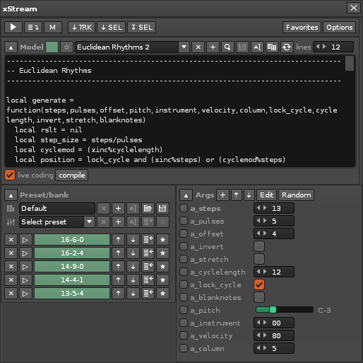
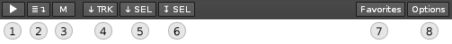
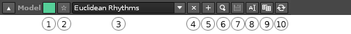
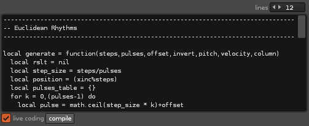
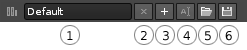
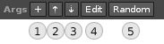

# xStream

xStream is a [Renoise tool](http://www.renoise.com/tools/xStream) that allows you to generate and/or transform  pattern/automation data via custom code. Depending on your experience with lua scripting, you can use the built-in functionality or create new scripts (models) from scratch.

## Features

* **Two output modes**: real-time/streaming (on-line) or offline 
* **Streaming mode** works across patterns, and even across pattern/block-loops
* **Offline mode** can apply output to the currently selected track, or a selection in the track 
* **MIDI Mappable** - trigger models & presets via MIDI and keyboard mappings
* **Live coding** the sandbox protects you against syntax errors while the tool is running
* **Lock and randomize** - retain control: locked arguments remain unaltered, can be linked too  
* **Preset Exchange** files are stored as plain text in a location of your choice 

## How it works

The heart of xStream is lies in it's ability to create and transform pattern/automation data on-the-fly. This is done by small programs that are referred to as _models_. You can use the existing examples, or create your own models from scratch.   

### Bundled examples

Here are a few examples to give you a taste of what xStream can be used for:

* **Step Sequencer** - a highly configurable step sequencer with a pattern-FX module for some more unusual effects.  
* **Voice Recorder** - a demonstration of how the built-in voice manager makes it possible to record live MIDI on the fly, much like how Renoise does it.  
* **Exponential Delay** - create 'bouncing ball' simulations, among other things. The controls correspond to physical aspects such as 'gravity', 'energy' and can create a wide variety of rhythms.      
* **Euclidean Rhythms** - ever since it was discovered that Euclidean number ratios can generate useful rhythms, the theory of the famous greek mathematician got applied to music as well.      
* **Granular** - this model generates swervy swarms of chopped-up sounds, using pitch and sample offset commands én masse. Works best on ambient and atmospheric sounds.
* **Chord Memory** - this model can read chords from the pattern and apply them anywhere. Useful to create shapshots of chord progressions, comes loaded with standard chord presets.       

### Limitations

**Single track:** xStream is designed to produce output for a single pattern or automation track only. Also, you can only run a single model at a time. Both are deliberate decisions, to give the tool a certain focus and simplicity. 

**Tempo:** Due to the nature of Lua scripting in Renoise, there is an upper limit to how fast a tempo you can reliably use when streaming in real-time (180 BPM / 8 LPB should be no problem, but twice the tempo might cause small gaps in the output). Precisely how high you can push the tempo depends on your system performance. If you have plenty of CPU power, you could try decrease the `writeahead` amount (accessed in Options > Streaming), to increase the number of lines being written.

**Modal Dialogs:** A modal dialog is a specific type of dialogs which prevent you from accessing the program until you have chosen an action, with a common example being the "Are you sure you want to XX" prompt. Triggering this type of dialog should be avoided while streaming, as it will produce a gap in the output while it is visible.  

## The user interface

xStream is deep! But once you get familiar with the interface it will seem a lot less intimidating. Also, the state is saved between sessions, to make it easy to pick up where you left off. 
 
 

Each major part of the user interface (code editor, presets, arguments) contain a small arrow in the top-left corner. This allows you to expand or contract that particular part of the interface, making the tool take up much less space on your screen. 

### Global toolbar 

 

1. **Play** 	  - Activate streaming and (re-)start playback [Space]
* **Status** 	  - Toggle whether streaming is active
* **Mute**	  - Mute/unmute stream
* **Apply to track** - Apply to the selected track
* **Apply to selection #1** - Apply to the selected lines (relative to top of pattern)
* **Apply to selection #2** - Apply to the selected lines (relative to start of selection)
* **Favorites** - Click to open the Favorites dialog
* **Options** - Click to open the Options dialog

### Models toolbar

The model toolbar is located just beneath the global toolbar, and provides access to all loaded models. 

 

1. **Color** - color makes it easier to recognize the model among favorites (click for color picker)
2. **Favorite** - add (or remove) the selected model to the [Favorites](#favorites-dialog)
3. **Selector** - choose any of the registered models
4. **Delete** - remove the model (delete the file from disk)
5. **Create/Import** - press this button to bring up the create & import dialog 
6. **Reveal** - press the magnifying glass to reveal the selected model in Finder/Explorer
7. **Save** - overwrite the selected model with the current state (including default presets)
8. **Rename** - assign a new name to the selected model (will rename the file on disk)
9. **Clone** - will prompt you for a location where a copy of the selected model should be saved to
10. **Revert/refresh** - click this to (re-)load the selected model from disk         

### Code Editor 

 

1. **#Lines** - Adjust how many lines the code editor should use	
* **Live coding** (checkbox) - Enable this option to compile the code as you type   
* **Compile** - Press this button to compile the code (not necessary when live coding is enabled)

### Preset/bank

#### Preset banks

 

1. **Bank select** - as a minimum, any model always contain a 'default' (internal) preset bank
2. **Remove bank** - click to remove the bank (note that you can't remove the default bank)
3. **Create bank** - click to create a new bank (a dialog will prompt you for the name)
4. **Rename bank** - click to rename the bank (note that you can't rename the default bank)
5. **Import/Merge** - click to import a bank into the currently selected bank
6. **Export bank** - click to export the selected bank to a file 

#### Presets

 

1. **Preset select** - click to choose among the available presets
* **Remove preset** - click to remove the preset 
* **Add preset** - click to add a new preset, based on the current argument settings
* **Rename preset** - click to assign a name/change the name of the preset
* **Update preset** - click to update the preset with the current argument settings
* **Favorite preset** - click to add the preset to the [Favorites](#favorites-dialog)   

#### Preset list

In addition to the presets (see above), you can click the arrow in the corner to show the preset list. This list will allow you to **schedule** a preset by clicking the small 'play' button, or **rearrange** items by clicking the up/down arrows. 

### Arguments

 

1. **Add argument** - Click to add a new argument to the selected model. Note that presets will ignore the argument until updated
2. **Move up** - Push the selected argument up in the list
3. **Move down** - Push the selected argument down in the list
4. **Edit** - Click to open the Argument Editor  
5. **Random** - Click to apply a random value to all unlocked arguments

#### Argument-list

The argument-list is visible when you have expanded the arguments panel using the arrow in the corner. The list contains the following features: 

 

1. **Lock** - Click the small checkbox to lock the argument. This will prevent it from changing as you apply random values to arguments, load presets or when the argument is set to poll/bind values from Renoise 
2. **Name** - The name that has been assigned to the argument. This is also the name used for identifying the argument within the code editor. Click the name to select the argument.
3. **Control** - Depending on the type of value, a controls can be used to interact with, change the value (some of these controls can be mapped to a MIDI controller). 
4. **Poll/Bind** - The small 'circle' next to the control indicates that the argument has been configured to poll or bind values in the Renoise API.   

### Argument editor

Arguments can be edited by pressing the 'Edit' button in the Arguments panel. Each argument can contain a combination of these fields:

 

1. **name** - Provide a name for the argument. The name you assign is used as an identifier in the output method - for example, `args.my_argument_name`   
* **description** - Will be used as a tooltip in the user interface
* **poll/bind** - Gives you the ability to poll or bind to values in the Renoise API. Using 'poll', you can specify any value - such as `rns.selected_instrument_index` - while 'bind' expects an observable value - such as `rns.selected_instrument_index_observable`. 
* **re-buffer** - When enabled, the buffer is recalculated each time the argument value has changed. This ensures that changes are written to the pattern as fast as possible. Default value is 'enabled' 
* **value-type** - Define the basic value type: boolean, number or string
* **display_as** - How the value is displayed to the user (slider, popup, checkbox, etc.). There are many different to choose from - which ones are valid depend on the value types you have selected (this is checked as you make a choice)  
* **min** - Minimum value (applies to numeric values only)
* **max** - Maximum value (applies to numeric values only)
* **zero-based** - Convert to zero-based values on-the-fly (applies to numeric value displayed as hex/integer)
* **items** (not shown) - Which items to display - applies to numeric value which are displayed as popup/chooser/switch

### Favorites dialog

TODO

### Options dialog       

#### General Options

**Autostart tool:** enable this option to automatically launch xStream when Renoise starts  

**Remember selected model:** enable this option to make xStream recall the last selected model you chose on startup. Alternatively (when disabled), specify any model that you want to use as the default.

**Userdata location:** provide a custom (alternative) location for xStream models, presets and favorites. If you are planning to create your own models, it is strongly recommended to specify a location outside of the tool folder, as this folder will be overwritten when/if you update the tool.

**Statistics:** Provides some handy statistics about the xStream tool, including RAM usage and current streaming position (if any) 

#### Streaming Options

**Suspend streaming while hidden:** if you are not planning to use the streaming feature while the main GUI is hidden, enable this checkbox. Triggering favorites will still work, but only while playback is stopped (offline mode, apply to track/selection). 

**Enable streaming:** this popup allows you to select among different modes to enable automatic streaming.  
`Manual`: enable the streaming from the global toolbar.  
`Auto - Play`: enable streaming once playback in Renoise starts.  
`Auto - Play + Edit`: enable streaming when starting playback while in edit mode.  

**Default scheduling:** choose the scheduling mode for favorites and presets.  
`None` - do not schedule  
`Beat` - wait for next beat (default setting)   
`Bar` - wait for next bar (depends on metronome beats)   
`Pattern` - wait until next pattern  

**Stream mute-mode:** choose the mute-mode that you prefer (muting is done via the Global toolbar).  
`None` - will stop producing output and instead, clear the pattern ahead of the streaming position.  
`Off` - will write initial note-offs, and then clear the pattern ahead of the streaming position.   

**Writeahead factor:** this value will determine how far ahead the streaming will write. Lower values will cause more lines to be written, while a higher value will decrease the number of lines. The _actual_ number of lines depends on the current BPM/LPB combination (the General Options will display this value).     

#### Output Options

Note that each model can override these values - they are only provided as sensible defaults. 

**include_hidden:** by default, xStream will not reveal note-columns if they don't receive any data. By enabling this feature, you can easily end up create fully expanded 12-note column / 8 effect-columns tracks, so use with care!

**clear_undefined:** this options will affect how xStream will treat undefined lines and columns. By default, all lines are defined, as the tool reads from the pattern. But if you should choose to define any column as {} (an empty table), or use of the constants `EMPTY_XLINE/EMPTY_NOTE_COLUMNS/EMPTY_EFFECT_COLUMNS`, then the lines will be cleared as a result. _Disable this option when you want to preserve existing data and only write explicitly defined values into the pattern._

**expand_columns:** enable this option to reveal columns and sub-columns as they receive data. For example, if a model is making use of the delay column, it will be allowed to show this column once you run the model. Of course, this is only relevant when your delay column was originally hidden.   

## Introduction to xStream programming 

Let's dive straight into the exciting stuff! You're encouraged to copy/paste some of this code into xStream, to experience it first-hand.  

### Creating a model from scratch

1. Click the '+' button in the model toolbar to show the 'Create/Import' dialog.
2. Next, select 'Create from scratch (empty)'

That's it - you now have a default, empty model to work with.  

### Producing pattern data

We can write pattern data by defining a method as simple as this one:

	-- produce an endless stream of C-4 notes...
	xline.note_columns[1].note_string = "C-4"

Pretty self-explanatory - `xline` refers to the current line in the track, and note_columns[1] is the first note column. The note is defined as a string, exactly as it shows in the pattern editor: `C-4`.
 
But to make things more interesting, we can define an _argument_ and use it like this:

	-- produce notes which match the value of our argument
	xline.note_columns[1].note_value = args.my_value

We switched from `note_string` to `note_value`. Since we are setting the value of a note, `my_value` is expected to be a number between 0-121 (see the [Lua reference](## xStream Lua Reference) for more details)

### Producing automation data

TODO

## xStream Lua Reference

xStream is using a subset of the Renoise Lua API. If you are not familiar with Lua or the Renoise API, it's recommended to visit the [Renoise scripting page](https://github.com/renoise/xrnx). Also, xStream comes with many examples, which should make learning easier.   

### Properties 

`rns` - shorthand for renoise.song()  
`renoise` - access to the global renoise object  
`xinc` - (number) an ever-increasing counter, initialized when output is started  
`xline` - (table) the current line, containing the following entries  
`xline.note_columns[]` - (table) access note columns in the xline  
`xline.note_columns[].note_value` -> [number, 0-119, 120=Off, 121=Empty]  
`xline.note_columns[].note_string` -> [string, 'C-0'-'G-9', 'OFF' or '---']  
`xline.note_columns[].instrument_value` -> [number, 0-254, 255==Empty]  
`xline.note_columns[].instrument_string` -> [string, '00'-'FE' or '..']  
`xline.note_columns[].volume_value` -> [number, 0-127, or number, 0-65535]  
`xline.note_columns[].volume_string` -> [string, '00'-'ZF' or '..']  
`xline.note_columns[].panning_value` -> [number, 0-127 or number, 0-65535]  
`xline.note_columns[].panning_string` -> [string, '00'-'ZF' or '..']  
`xline.note_columns[].delay_value` -> [number, 0-255]  
`xline.note_columns[].delay_string` -> [string, '00'-'FF' or '..']  
`xline.effect_columns[]` - (table) access effect columns in the xline  
`xline.effect_columns[].number_value` -> [number, 0-65535]  
`xline.effect_columns[].number_string` -> [string, '00'-'ZZ']  
`xline.effect_columns[].amount_value` -> [number, 0-255]  
`xline.effect_columns[].amount_string` -> [string, '00'-'FF']  
`xpos (xSongPos)` -> the song position - see also xLib documentation  
`xpos.line (number)` -> line in pattern  
`xpos.sequence (number)` -> pattern sequence index  
`xpos.lines_travelled (number)` -> lines travelled since output started   
`args (table, ObservableXXX)` -> access to model arguments  
`xstream (xStream)` -> access to the xStream instance  
`buffer (xStreamBuffer)` -> access to the stream buffer (shorthand for xstream.buffer)  
`voices (table<xMidiMessage>)` -> access the active voices (shorthand for voicemgr.voices)  
`voicemgr (xVoiceManager)` -> access the voice-manager  
`data (table)` -> optional user-data, access via "data.my_value"  
`clear_undefined (boolean)` -> how to treat empty lines (see Options dialog for more details)  
`expand_columns (boolean)` -> whether to automatically show columns as data is written  
`include_hidden (boolean)` -> whether to include hidden columns when reading & writing  
`automation_playmode (xStream.PLAYMODE)` -> the current playmode: POINTS,LINEAR,CUBIC   
`track_index (number)` -> the selected track index  
`mute_mode (xStream.MUTE_MODE)` -> the current mute mode: NONE,OFF  
`output_mode (xStream.OUTPUT_MODE)` -> the current output mode: STREAMING,TRACK,SELECTION

### Constants

	NOTE_OFF_VALUE = 121 ("OFF")
	EMPTY_NOTE_VALUE = 120 ("---")
	EMPTY_VOLUME_VALUE = 255
	EMPTY_VALUE = 255
	EMPTY_NOTE_COLUMNS = (table)
	EMPTY_EFFECT_COLUMNS = (table)
	EMPTY_XLINE = (table)
	SUPPORTED_EFFECT_CHARS = (table)

### Classes

	xLib
	xStream
	xTrack
	xTransport
	xScale
	xMidiMessage
	xOscMessage
	xAutomation
	xParameter
	xPlayPos
	xAudioDevice
	xPhraseManager

