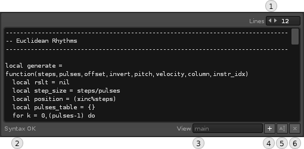

# UI: Code Editor 

< [The user interface](user_interface.md)

The code editor is a basic textfield. It is responsible for showing you the code for the selected aspect (e.g. the `main` method), and the whether the code is valid or contains some kind of error. 

 

|Name|Description|
|----|-----------|
| Lines | Adjust how many lines the editor should use  
| Status | Provides feedback on the state of the code. Errors are displayed with a warning sign, which you can click or mouse-over for more details. 
| View | This popup lists the available aspects, starting `main` method, and then continuing with `data` and `events`. 
| Add | Adds a new aspect to the model. Clicking it will bring up the [events & data](events_data.md) dialog
| Rename | Click to rename the aspect (currently, data is the only type which can be renamed).   
| Delete | Applies to data and events.   

