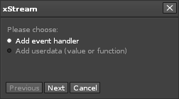
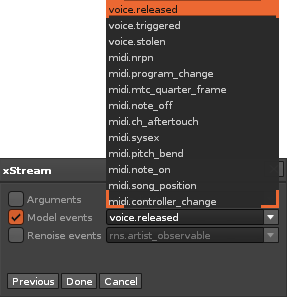

#### Events & Data 

Clicking the '+' button in the code editor will bring up the Events & Data dialog. Here you can add predefined data or set up event handlers for your model:

##### Event dialog

This page contains every type of event which is accessible to you. 

  
_Event dialog showing the model events selector_ 

* **Arguments** - The list will contain all defined arguments for the currently loaded model. 
* **Model events** - Lists all events which are related to the model (MIDI, voice-manager)
* **Renoise events** - Lists all recognized Renoise API events    

##### Data dialog

This page asks you to specify a name for your data. The name has to be unique (not already in use) and a valid Lua identifier (normal latin characters, and not beginning with a number). You can choose a type too, such as `number` or `string`. 

When you press 'Done', a small code template is generated, according to the type of value you chose. Note that you can change this type at any time - the template is only meant as a starting point.    
    
