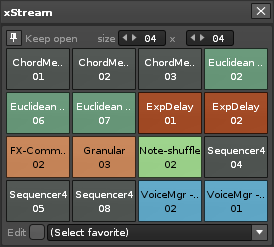

# Favorites

The favorites grid provides a visual overview of the models and presets that you want quick access to.

 

Note that the grid is fully MIDI mappable (CMD/CTRL+M) and can be triggered via keyboard shortcuts (Renoise Preferences > Keys, search for 'xstream'). 

#### Editing favorites

Click the 'Edit' checkbox to enter editing mode, with a number of options for each preset: 

* **Model/Bank/Preset** - choose the model and/or preset to store at this position.  
* **Launch** - specify the launch mode. 
	* AUTOMATIC (default) - will automatically decide how to apply the favorite. 
		* If not playing and a selection has been defined, apply to selection
		* If not playing and no selection exist, apply to track
		* Otherwise, produce streaming output
	* STREAMING - force favorite to use streaming mode (online)
	* TRACK - apply to track (offline)
	* SELECTION - apply to selection (offline)

