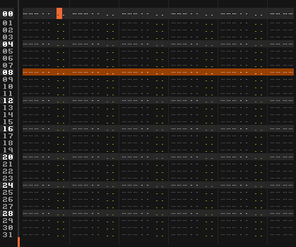

# Introduction

## What is xStream?

xStream is tool for [Renoise](http://www.renoise.com/tools) that can use _live evaluated code_ for on-the-fly "re-programming" of the pattern editor and automation data. 

The idea is to open up the pattern, make it accessible through scripting, and allow real-time control of every aspect. This is done through something called _models_, small programs that are able to produce constant _streaming_ output, can be controlled via _arguments_ and respond to _events_. 

Sounds complicated? Well, xStream is somewhere between a development tool and an instrument, so no wonder. But the model is also the single most important concept in xStream - and the most complicated one. Recommended reading: [introduction to models](about_models.md).

## How to use the tool

As a tool, xStream is pretty open-ended. You can use it strictly as a compositional aid - "stamp" the output onto a given range (track or selection), using the available keyboard shortcuts. Or you can connect your MIDI controller and use it for improvisation and live/streaming recordings.

The next page, [User Interface](user_interface.md), aims to make you familiar with basic operation. But essentially, you have a very powerful favorites & preset system that can create shapshots of any given settings. You can recall presets and stream or apply them anywhere, to [any track](known_limitations-gotchas.md) in Renoise. Also, streaming can be configured to start automatically, when playback is active, or when playing while in edit mode. 

## How does streaming work?

The basic idea is quite simple - when you hit 'play' in xStream, everything you hear is the result of notes and pattern commands that got written into the pattern a little bit ahead of time. xStream has been built from the ground up, around that very idea. It works like this: 

 

It could also be described as a road that is laid out in front of you, as you travel forward. Just how _far_ ahead (how many lines) is determined by the `writeahead` amount, which in turn depends on a combination of the current BPM and LPB. But the point is to ensure a constant, steady stream of output. 

The actual output is produced by the `main` method of the model. Nothing weird about that, just some code that is evaluated once for every line. But as a result, every parameter tweak, switched preset or change to the running code is captured entirely in the pattern. Actually, the hard part is _not_ to record these things (hint: you can't). 

### Working with loops & boundaries 

When the output meets a boundary of some sort - the end of a pattern, or the song - the tool is smart enough to 'wrap' the output around. Essentially, it follows - or at least, tries to follow, your every move inside the pattern sequence. This includes not only pattern loops but also block and sequence loops.

The boundary-detection is very nice when live streaming, but disabled while using the tool in [offline mode](main_toolbar,md#offline_output). If you apply the selected model to the selected range in the pattern, it wouldn't be desirable that a block loop affected the output - and it won't. 

### Recording a performance

Since xStream is always recording while streaming, the trick is to 'direct' the output where you want it. By default, xStream simply writes to the currently selected track in the currently playing pattern. So capturing a complete live performance doesn't involve much more than setting up a number of patterns in advance and then hitting 'play'. 

You could also consider installing a small tool such as [AutoClonePatterns](...). It allow you to jam on top of a backing track, in the form of a pattern or series of looped patterns.

> Next - [User Interface](user_interface.md) >

