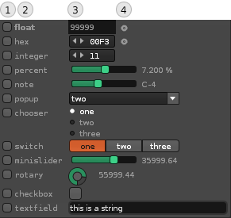
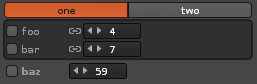
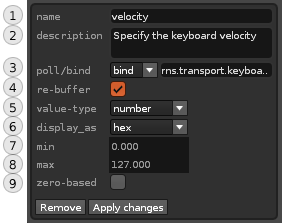

# UI: Arguments

< [The user interface](user_interface.md)

Arguments offer control of a values in a running model. For example, the base-note or velocity. 
They are shown as on-screen controls: sliders, checkboxes, etc., and situated underneath the editor. 

...illustration 

### Arguments

 

1. **Add argument** - Click to add a new argument to the selected model. 
* **Move up** - Push the selected argument up in the list
* **Move down** - Push the selected argument down in the list
* **Edit** - Click to open the Argument Editor  
* **Random** - Click to apply a random value to all unlocked arguments

#### Argument-list

The argument-list is visible when you have expanded the arguments panel using the arrow in the corner. The list contains the following features: 

 

1. **Lock** - Click the small checkbox to lock the argument. This will prevent it from changing as you apply random values to arguments, load presets or when the argument is set to poll/bind values from Renoise 
* **Name** - The name that has been assigned to the argument. This is also the name used for identifying the argument within the code editor. Click the name to select the argument.
* **Control** - Depending on the type of value, a controls can be used to interact with, change the value (most of these controls can be mapped to a MIDI controller). 
* **Poll/Bind** - The small 'circle' next to the control indicates that the argument has been configured to poll or bind values in the Renoise API.
* **Link** - (not shown) Clicking the small chain icon between the name and control to establish a link between similarly-named arguments across tabs. Once linked, changing the argument value will propagate the change to all other unlocked arguments bearing the same name.   
   

##### Organizing arguments in tabs  

When your model has a lot of arguments, it can be practical to organize things in tabs. To do this, xStream supports the use of dot.syntax. Simply prepend the name of the tab to your argument like this: `args.my_tab_name.my_arg_name` - and the tab will be created automatically. 

  
_Example of two tabs_

Note that dot syntax is limited to one dot in a argument name. Oh, and each part (tab and argument) both need to be valid Lua identifiers - so, no special characters or names starting with numbers.

### Argument editor

Arguments can be edited by pressing the 'Edit' button in the Arguments panel. Each argument can contain a combination of these fields:

 

1. **name** - Provide a name for the argument. The name you assign is used as an identifier in the output method - for example, `args.my_argument_name`   
* **description** - Will be used as a tooltip in the user interface
* **poll/bind** - Gives you the ability to poll or bind to values in the Renoise API. Using 'poll', you can specify any value - such as `rns.selected_instrument_index` - while 'bind' expects an observable value - such as `rns.selected_instrument_index_observable`. 
* **re-buffer** - When enabled, the output buffer is recalculated each time the argument value has changed. This ensures that changes are written to the pattern as fast as possible. Default is 'on'.
* **value-type** - Define the basic value type: boolean, number or string
* **display_as** - How the value is displayed to the user (validated when you hit 'Apply')  
* **min** - Minimum value (applies to numeric values only)
* **max** - Maximum value (applies to numeric values only)
* **zero-based** - Convert to zero-based values on-the-fly (applies to numeric value displayed as hex/integer)
* **items** (not shown) - Which items to display - applies to numeric value which are displayed as popup/chooser/switch
* **load-bang** (not shown) - Enable this feature to trigger [event handlers](#event-dialog) on startup. Default is 'on'.

## Adding an argument

Hit the '+' button - the argument-editor panel appears:

...illustration

From here, you can adjust all properties of the selected arguments. This includes:

## 

From the code, you can reference arguments by their name, e.g. "args.my_volume". 

> Note that it is possible to both specify (set) and retrieve (get) the value of an argument through code. The user-interface will update to reflect a value which has been set through code.

An argument can be one of the following basic types: 

    number/boolean/string

Additionally, you can choose how to _display_ the argument. 

    float
    hex
    integer
    percent
    note
    popup
    chooser
    switch
    minislider
    rotary
    checkbox
    textfield
    value

### Tabbed arguments

When there are too many arguments to fit on the screen, you can organize them in a tabbed interface, simply by prefixing the name with the tab name. 

For example, "voice1.volume" and "voice2.volume" will create two tabs, labelled `voice1` and `voice2`, and add a volume inside each one. 

From your code, you simply reference them with their full name, e.g. "voice1.volume".