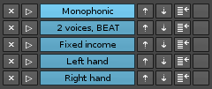

# UI: Preset/bank

< [The user interface](user_interface.md)

#### Preset banks

 

1. **Bank select** - as a minimum, any model always contain a 'default' (internal) preset bank
* **Remove bank** - click to remove the bank (note that you can't remove the default bank)
* **Create bank** - click to create a new bank (a dialog will prompt you for the name)
* **Rename bank** - click to rename the bank (note that you can't rename the default bank)
* **Import/Merge** - click to import a bank into the currently selected bank
* **Export bank** - click to export the selected bank to a file 

#### Presets

 

1. **Preset select** - click to choose among the available presets
* **Remove preset** - click to remove the preset 
* **Add preset** - click to add a new preset, based on the current argument settings
* **Rename preset** - click to assign a name/change the name of the preset
* **Update preset** - click to update the preset with the current argument settings
* **Favorite preset** - click to add the preset to the [Favorites](#favorites-dialog)   

#### Preset list

In addition to the presets (see above), you can click the arrow in the corner to show the preset list. This list will allow you to **schedule** a preset by clicking the small 'play' button, or **rearrange** items by clicking the up/down arrows. 

 

